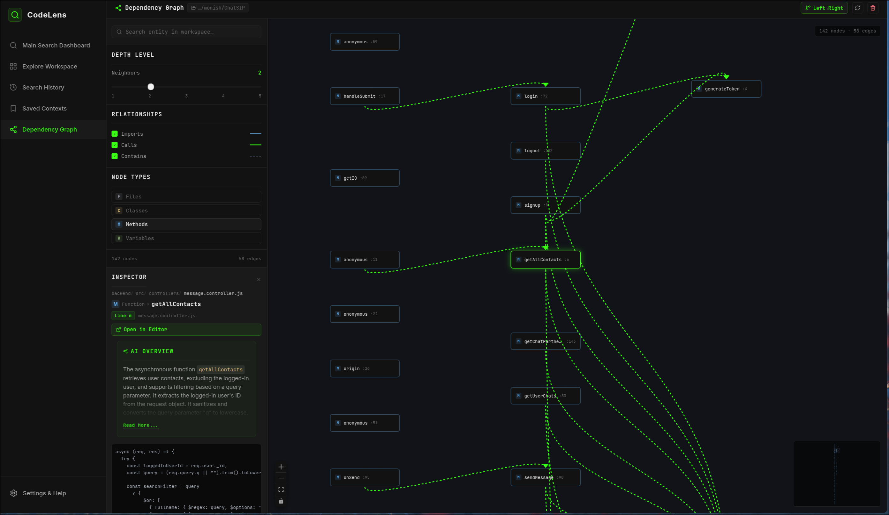
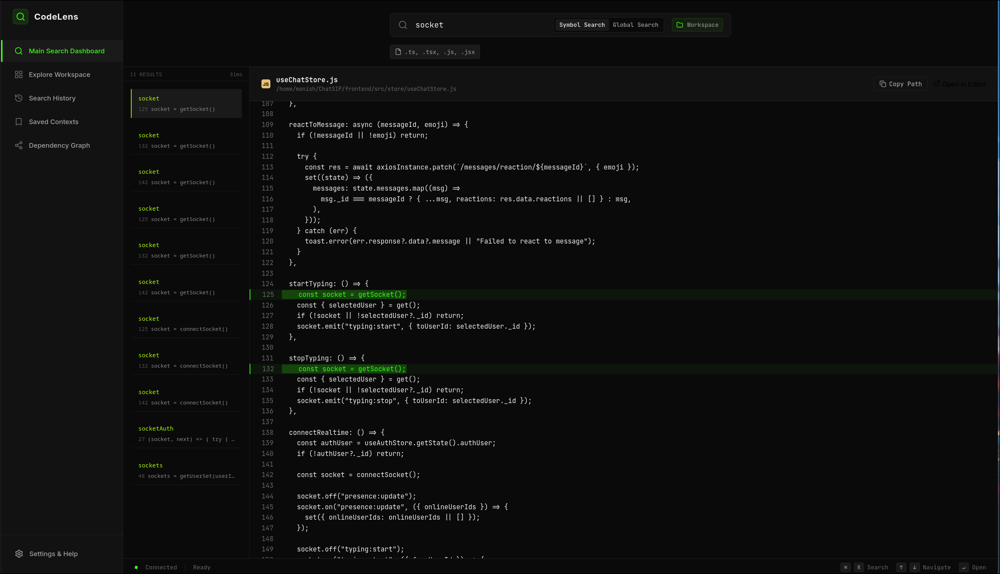
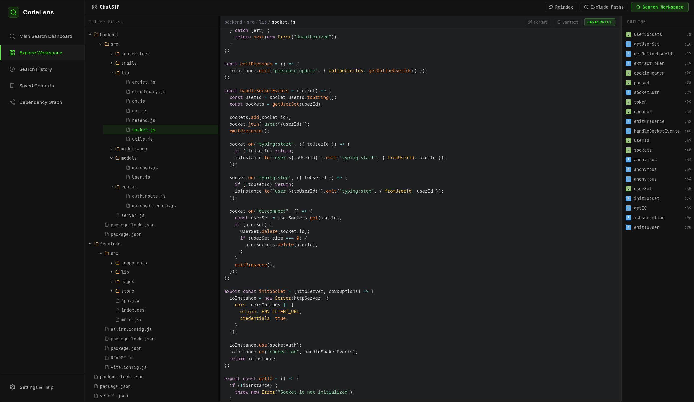
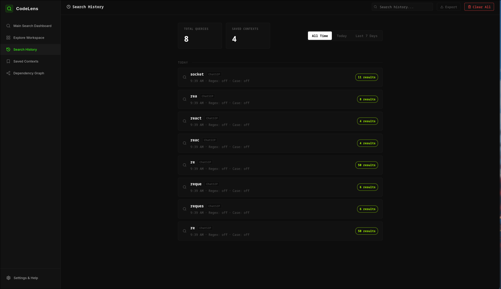
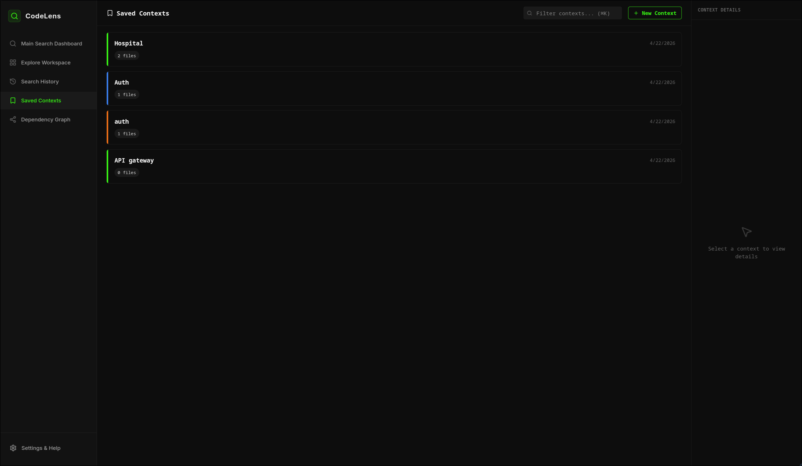

# CodeLENS

CodeLENS is a local-first developer tool for structured code search and architectural analysis. It is designed to provide deeper codebase comprehension by combining AST-based indexing with interactive visualization, enabling developers to navigate large repositories more effectively than with standard text search.

## Core Objectives

- **Privacy and Reliability**: Operates entirely locally. Your code is processed on your machine, ensuring privacy and allowing the tool to function without a network connection.
- **Performance**: Targeted search latency of under 100ms. The system uses SQLite FTS5 to provide near-instant results even in large codebases.
- **Structural Understanding**: Uses Tree-sitter to parse source code into Abstract Syntax Trees (AST). This allows the tool to understand code entities like functions, classes, and variables rather than just raw text.

## Features

### Dependency Visualization

Generates interactive graphs to show relationships between code entities. You can trace call chains, explore imports, and visualize module dependencies to understand the overall architecture.

### Entity-Aware Search

The search engine is optimized for software identifiers, supporting snake_case and camelCase tokenization. It ranks results based on structural importance and definitions.

### Incremental Background Indexing
Monitors your workspace for file changes using `chokidar` and updates the index in the background. This ensures that search results and graph data stay synchronized with your latest code changes.

### AI-Driven Overviews
Integrates with Gemini via OpenRouter to provide technical summaries of components. These summaries explain the purpose and context of code snippets to speed up onboarding and reviews.

### Workspace Exploration

Navigate your codebase with an integrated file explorer and code viewer, providing immediate context for any selected entity.

### Search History & Insights

Keep track of your exploration journey with a detailed search history and statistics on workspace composition.

### Saved Contexts

Organize your research into logical contexts, allowing you to quickly switch between different feature areas or architectural layers.

## System Architecture

The project is built with a modular architecture:
- **Workspace Manager**: Manages local directory scanning and repository state.
- **File Parser**: Extracts structural data using Tree-sitter.
- **Index Engine**: Maintains an inverted index in SQLite for fast retrieval.
- **Code Intelligence**: Tracks relationships and answers "where is this used?" queries.

## Technical Stack

- **Frontend**: React, Vite, XYFlow (React Flow)
- **Backend**: Node.js, Express
- **Database**: SQLite (FTS5) for indexing and metadata
- **Parsing**: Tree-sitter for high-precision AST generation
- **AI Integration**: OpenRouter (Gemini 2.0) for component summaries

## Setup

### Prerequisites
- Node.js (v20 or higher)
- OpenRouter API Key (for AI-driven summaries)

### Installation
1. Clone the repository:
   ```bash
   git clone https://github.com/yourusername/codelens.git
   cd codelens
   
   ```
2. Install dependencies:
   ```bash
   npm install
   ```

### Configuration
Create a `.env` file in the root directory:
```env
OPENROUTER_API_KEY=your_api_key_here
```

### Execution
Run the development environment:
```bash
npm run dev:all
```
The application will be available at `http://localhost:5173`.

## Implementation Details

- **Security**: The tool operates in a read-only mode relative to your codebase to ensure no accidental modifications occur.
- **Resource Efficiency**: Designed to maintain a low memory footprint (typically <150MB RAM) during background indexing and search.
- **Scalability**: Capable of indexing large repositories in under a minute using batch processing and SQLite's WAL mode.
