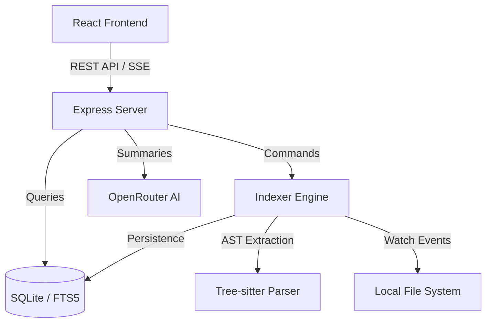

# SYSTEM_CONTEXT.md: CodeLENS Architectural Overview

## 1. Core Purpose
**CodeLENS** is a local-first developer tool for structured code search and architectural analysis. It solves the problem of "codebase blindness" in large repositories by providing:
- **Structural Search**: Finding code by entity type (functions, classes) rather than raw text.
- **Dependency Visualization**: Interactive graphs of how components interact.
- **Impact Analysis**: Determining the "blast radius" of changes.
- **AI-Augmented Context**: Generating on-demand summaries of complex modules without leaving the local environment.

## 2. Tech Stack & Architecture
The application follows a **Monolithic Local-First Architecture** with a clear separation between the data-indexing engine and the visualization frontend.

- **Frontend**: 
  - **React 19 / Vite**: Core UI framework.
  - **XYFlow (React Flow)**: Nodes/Edges visualization engine.
  - **Dagre**: Automatic layout engine for directed graphs.
  - **PrismJS**: Syntax highlighting.
- **Backend**: 
  - **Node.js / Express**: REST API and SSE (Server-Sent Events) for real-time progress.
  - **Better-SQLite3**: High-performance local storage with WAL (Write-Ahead Logging) enabled.
  - **Tree-sitter**: Incremental AST parsing for JavaScript, TypeScript, and TSX.
  - **Chokidar**: File system monitoring for incremental re-indexing.
- **Directory Structure Logic**:
  - `src/backend/`: Core logic engines (DB, Indexer, Parser, API).
  - `src/pages/`: Feature-specific views (Graph, Dashboard, Explore).
  - `src/components/`: Atomic UI parts and layout wrappers.

## 3. Data Flow & State
### Indexing Pipeline (Write Path)
1. **Trigger**: User picks a workspace or `chokidar` detects a file change.
2. **Scan**: `Indexer.ts` recursively gathers files, skipping `node_modules` and ignored paths.
3. **Parse**: `Parser.ts` uses Tree-sitter to extract `ParsedEntity` objects (Functions, Classes, Variables, Comments).
4. **Transform**: Calculates cyclomatic complexity and extracts `calls` (call-sites).
5. **Persist**: 
   - `files`: Path/Hash metadata.
   - `entities`: Structural data.
   - `relations`: Call/Import links (resolved via SQL transactions).
   - `search_index`: FTS5 virtual table for lightning-fast full-text search.

### Query Flow (Read Path)
- **Source of Truth**: `codelens.db` (SQLite).
- **State Management**: Frontend uses standard React state and hooks to fetch data from the REST API.
- **Search**: Uses SQLite FTS5 `MATCH` queries with custom ranking logic (Exact > StartsWith > TypePriority).

## 4. Key Modules & Entry Points
- **`src/backend/server.ts`**: The central nervous system. Defines all REST routes and coordinates the `Indexer`.
- **`src/backend/db/connection.ts`**: Defines the relational schema and FTS5 configuration. **Start here to understand the data model.**
- **`src/backend/indexer/Indexer.ts`**: Orchestrates the batch processing of files and incremental updates.
- **`src/backend/indexer/Parser.ts`**: The AST "brain". Translates raw source code into structured relational data.
- **`src/App.jsx`**: Frontend entry point and routing table.

## 5. Agent Integration Points
AI Agents should target these locations for specific tasks:
- **Adding Analysis Tools**: Implement new SQL-based metrics in `server.ts` or add data extraction logic in `Parser.ts`.
- **New Language Support**: Register new Tree-sitter grammars in `Parser.ts` and update `Indexer.isSupportedExtension`.
- **UI Enhancements**: Create new views in `src/pages/` and link them in `App.jsx`.
- **AI Prompts**: Modify the engineering prompt in the `/api/contexts/summary` route in `server.ts`.

## 6. Dependency Graph (Interaction Model)

---
*Generated by Antigravity Senior Architect AI*
